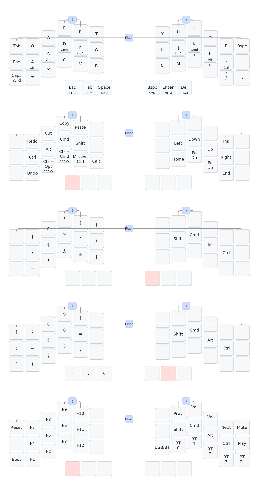

# Crosses 42 — ZMK config (ergonomic / ulnar-nerve-friendly macOS layout)

Wireless firmware config for the **Good Great Grand Wonderful (GGGW) Crosses 42**
(3×6 + 3 thumbs), built on home-row mods with dedicated copy/paste/undo keys so
your pinky never holds a modifier.



- **Base:** QWERTY with home-row mods — `A/S/D/F` = Ctrl/Opt/Cmd/Shift (mirrored on the right).
- **Nav layer** (hold left inner thumb): copy/paste/cut/undo/redo, arrows, PgUp/PgDn/Home/End,
  Mission Control, Calculator, and sticky **Ctrl+Opt** / **Ctrl+Cmd**.
- **Sym / Num / Fun** layers on the other thumbs.

---

## Step 1 — Which controller do you have? (do this first)

The firmware target depends on your nice!nano version:

- **nice!nano v2** (default in this repo) — the chip on the board is a squarish
  metal can; sold on virtually all Crosses BT kits from ~2021 onward.
- **nice!nano v1** — older; if unsure, check where you bought it or the seller's listing.

This repo is set to **v2**. If you have **v1** (or a clone that enumerates as v1),
open `build.yaml` and change every `nice_nano_v2` to `nice_nano`. That's the only change.

> Not sure? Build v2 first. If a half powers on but never appears over USB as a
> drive in bootloader mode, or the firmware won't boot, try v1.

---

## Step 2 — Put this config on GitHub

1. Create a **new GitHub repository** (e.g. `crosses-zmk-config`), empty, public or private.
2. Upload every file from this folder, preserving structure:
   ```
   .github/workflows/build.yml
   build.yaml
   config/west.yml
   config/crosses.keymap
   config/crosses.conf
   config/info.json
   keymap_drawer.config.yaml
   keymap-drawer/crosses.png
   ```
   (Web UI: "Add file → Upload files", drag them in. Or use `git`.)
3. Commit.

## Step 3 — Let GitHub build the firmware

- Pushing the commit automatically triggers the **Actions** tab.
- Wait ~3–5 minutes for "Build ZMK firmware" to finish (green check).
- Open the finished run → **Artifacts** → download **`firmware.zip`**.
- Inside you'll find:
  - `crosses_42_left-nice_nano_v2-zmk.uf2`
  - `crosses_42_right-nice_nano_v2-zmk.uf2`
  - `settings_reset-nice_nano_v2-zmk.uf2`

## Step 4 — Flash both halves

For **each** half, one at a time:

1. Plug the half into your Mac with a **data** USB-C cable (not charge-only).
2. Enter the bootloader: **double-tap the reset button** on the nice!nano
   (quick double-press). A drive named **`NICENANO`** mounts in Finder.
3. Drag the matching `.uf2` onto that drive:
   - left half → `crosses_42_left-…​.uf2`
   - right half → `crosses_42_right-…​.uf2`
4. The drive auto-ejects and the half reboots. Done.
5. Repeat for the other half.

> First time only, or if the halves won't talk: flash
> `settings_reset-…​.uf2` to **both** halves first, then flash left/right.

## Step 5 — Pair to your Mac

1. After flashing, the **right half** is the central — it advertises over Bluetooth.
   (macOS: System Settings → Bluetooth → select the keyboard.)
2. The left half connects to the right automatically.
3. Switch/clear BLE profiles from the **Fun layer** (hold left outer thumb):
   `BT 0–3` select a profile, `BT Clr` clears the current one.

You're typing wirelessly.

---

## Editing later (two easy paths)

- **Visual editor:** open <https://nickcoutsos.github.io/keymap-editor/>, connect your
  GitHub repo, edit by drag-and-drop, commit — Actions rebuilds automatically.
- **ZMK Studio (live, no rebuild):** the right half is Studio-enabled. Plug it in via
  USB and open <https://zmk.studio> to move keys in real time.

## Tuning the home-row mods

In `config/crosses.keymap`, top of the file:
- Mods firing when you meant to type? Raise `tapping-term-ms` (try `300`–`320`).
- Holds feel sluggish? Lower it (try `240`).
- Leave the `hold-trigger-key-positions` lines alone — they're what make fast
  same-hand rolls safe.

## Regenerate the keymap image (optional)

```bash
pip install keymap-drawer
keymap -c keymap_drawer.config.yaml parse -z config/crosses.keymap > keymap.yaml
keymap -c keymap_drawer.config.yaml draw keymap.yaml -j config/info.json \
  -l gggw_crosses_42_layout > keymap-drawer/crosses.svg
```
